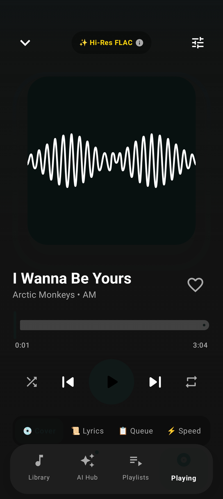
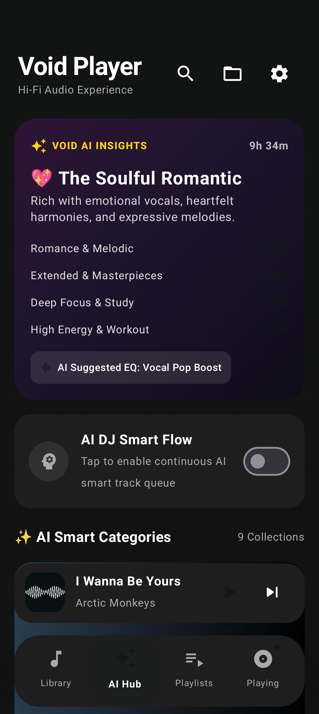
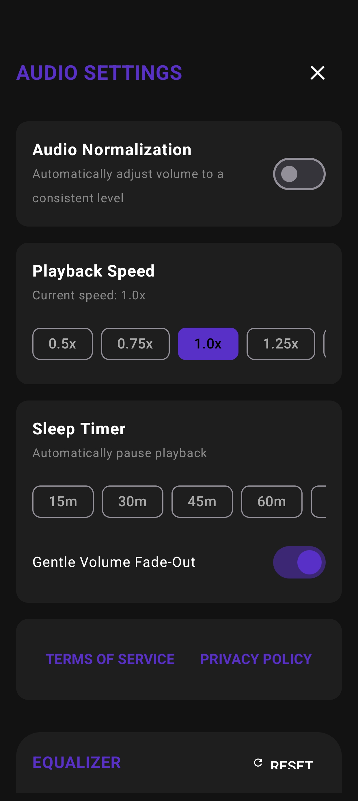
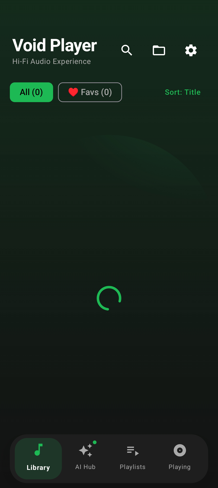

# Void Player

<div align="center">

<a href="https://f-droid.org/en/packages/com.tushar.voidplayer/">
  
</a>
&nbsp;&nbsp;
<a href="https://www.microsoft.com/store/productId/9PCPXRSJ02RS?ocid=libraryshare">
  
</a>

<br/><br/>

[](https://f-droid.org/en/packages/com.tushar.voidplayer/)
[](https://www.microsoft.com/store/productId/9PCPXRSJ02RS?ocid=libraryshare)
[](https://github.com/TUSHAR91316/Void-Player/releases/latest)
[](https://kotlinlang.org/)
[](https://www.jetbrains.com/lp/compose-multiplatform/)
[](./LICENSE)
[](https://developer.android.com/)
[](https://www.microsoft.com/store/productId/9PCPXRSJ02RS?ocid=libraryshare)

**A modern, high-fidelity, privacy-first local music player built with Kotlin Multiplatform and Compose Multiplatform.**

100% Free and Open Source (FOSS) — Zero Ads — Zero Trackers — Zero Telemetry — 100% Offline

[Get it on F-Droid](https://f-droid.org/en/packages/com.tushar.voidplayer/) &nbsp;·&nbsp; [Microsoft Store](https://www.microsoft.com/store/productId/9PCPXRSJ02RS?ocid=libraryshare) &nbsp;·&nbsp; [Download APK (GitHub Releases)](https://github.com/TUSHAR91316/Void-Player/releases/latest)

</div>


---

## Screenshots

<div align="center">

| Now Playing | AI Music Hub | Audio Settings | Library |
|:---:|:---:|:---:|:---:|
|  |  |  |  |

</div>

---

## Features

### Navigation and Playback Controls

Void Player uses a persistent four-tab bottom navigation bar so that the active tab is always reachable without interrupting playback:

- **Library** — Full song list with favorites filter, text search across title, artist, and album, column sorting (Title / Artist / Duration), and folder picker.
- **AI Hub** — Void AI Insights ("My Vibe Wrapped"), AI DJ Smart Flow, and automatic mood-based collections.
- **Playlists** — Create, manage, and play custom playlists backed by local persistent storage.
- **Now Playing** — Dedicated full-screen player with immersive artwork gradient, gesture controls, lyrics, queue, and speed controls.

A floating Mini-Player Pill sits above the navigation bar, displaying the current track title, artist, a live progress line, quick play/pause and next-track buttons, and expanding to the full Now Playing screen on tap.

### Now Playing Screen

- Dynamic background gradient extracted from album artwork using the Android Palette API.
- Swipe left or right on the album artwork to skip tracks; swipe down or press the system back button to minimize to the Mini-Player Pill.
- Multi-mode slide-up drawer with four panels:
  - **Cover** — Full-resolution album artwork.
  - **Lyrics** — Real-time synchronized LRC lyrics with active-line accent, smooth auto-scroll, and tap-to-seek.
  - **Queue** — Live upcoming track list with one-tap jump-to-song.
  - **Controls** — Playback speed (0.5x to 2.0x, pitch-corrected) and Gentle Sleep Timer with volume fade-out.

### AI Music Intelligence (Fully Offline SML Engine)

Void Player features an embedded Small Machine Learning (SML) audio intelligence engine running 100% on-device. No internet connection, external APIs, or remote neural weights are utilized—ensuring total privacy and zero latency.

- **Multi-Feature Vector Classification** — Analyzes local tracks using multidimensional feature space modeling:
  - **Genre Semantic Centroids**: Categorizes tracks across 12+ genre vector spaces (Night Vibes & Lo-Fi, High Energy & Workout, Deep Focus & Study, Romance & Heartfelt, Euphoric Pop, Late Night Drive & Synthwave, Acoustic Folk, Heavy Metal, and Extended Masterpieces).
  - **Continuous Acoustic Energy Extraction**: Computes normalized intensity scores ($0.08 \dots 0.98$) combining genre baselines, embedded ID3/FLAC tempo (BPM), and duration curve dynamics.
  - **Softmax Probability Calibration**: Normalizes feature distance scores through temperature-scaled softmax ($T=12.0$), yielding calibrated confidence ratings ($45\% \dots 99\%$) and eliminating unclassified fallback buckets.
- **Harmonic DJ Smart Flow** — Generates seamless, harmonic playlist progressions without jarring tempo or energy spikes by evaluating transition compatibility:
  $$\text{FlowScore}(A, B) = \text{MoodContinuity}(A, B) \times 0.45 + (1 - \Delta\text{Energy} \times 1.5) \times 0.35 + \left(1 - \frac{\Delta\text{BPM}}{60}\right) \times 0.20$$
- **Void AI Insights ("My Vibe Wrapped")** — Aggregates library statistics to calculate your musical persona (such as *The Midnight Wanderer*, *The High-Drive Dynamo*, *The Deep Focus Architect*, or *The Neon Cruiser*), vibe breakdown percentages, library-wide acoustic energy averages, total listening duration, and recommended hardware equalizer presets.
- **Smart Mood Collections** — Automatically organizes your local songs into dynamically clustered collections with custom gradient artwork, confidence indicators, and tailored audio DSP curves.

### Audio Quality & Hardware DSP

- **Hardware Audio DSP & Equalizer** — Native integration with Android `android.media.audiofx.Equalizer` and `android.media.audiofx.BassBoost` (0–1000 strength), featuring persistent audio presets (*Flat*, *Bass Boost*, *Vocal Pop*, *Electronic*, *Rock*, *Acoustic*), custom band levels, and dynamics processing.
- **Hi-Res Codec Detection** — Identifies FLAC (24-bit/96kHz lossless), WAV (uncompressed PCM), AAC HD, OGG/Opus, and MP3 (up to 320 kbps) directly from file streams and headers.
- **Codec Inspector** — View real measured bitrates, bit depths, sample rates, channels, and container formats powered by native metadata extractors and TagLib.
- **Dual-Engine Synchronized Lyrics** — Real-time LRC synchronized lyrics engine with auto-scroll and tap-to-seek:
  - Reads local `.lrc` files in the song folder.
  - Automatically fetches missing lyrics via the privacy-friendly LRCLIB database, storing them permanently in local offline cache (`lyrics_cache/`) for future playback.
- **Gentle Sleep Timer** — Set a custom countdown timer; the final 20 seconds gently fade volume to zero before pausing.

### Persistence and Data

- Custom playlists, favorite tracks, hardware equalizer configurations, and playback states are stored locally in `SharedPreferences` (Android) or typed JSON app data files (Windows).
- The last selected music folder is remembered and reloaded automatically on launch.
- 100% offline and private: no cloud syncing, no data harvesting.

### Back Navigation

A cross-platform `PlatformBackHandler` intercepts system back gestures and keys in strict priority order: dismiss open modal sheets and dialogs, clear active search queries, return to previous navigation tabs, and return to the Library before allowing the app to exit.

### Windows Desktop (Native WinUI 3)

- Native Windows App SDK / WinUI 3 application (`desktop-winui`) with Mica material backdrops and smooth window chrome.
- Spotify-style layout featuring a collapsible left navigation rail, center searchable library with column sorting, and split-pane right drawer for synced lyrics, live queue, and codec specifications.
- Persistent full-width bottom player bar with responsive seek slider, volume control, mute toggle, and track artwork thumbnail.
- TagLibSharp metadata extractor delivering precise codec specs without simulated estimates.
- Distributed via the official Microsoft Store (`Byte-Labs.VoidPlayer`, Store ID: `9PCPXRSJ02RS`).

---

## Technology Stack

| Layer | Android Mobile | Windows Desktop |
|---|---|---|
| Language | Kotlin 2.x | C# / .NET 10 |
| UI Framework | Compose Multiplatform 1.7 (Material 3) | WinUI 3 / Windows App SDK 2.4 (Mica) |
| Audio Engine | AndroidX Media3 / ExoPlayer | Windows Media Player API / WinUI Audio |
| Audio DSP | Android AudioFX (BassBoost, Equalizer) | Native Software Equalizer & Dynamics |
| AI / ML Engine | Embedded SML Vector Space Engine | Embedded SML Vector Space Engine |
| Metadata Parser | Android MediaMetadataRetriever / SAF | TagLibSharp (ID3v2, FLAC, Vorbis) |
| Lyrics Provider | Local LRC + LRCLIB Offline Cache | Local LRC + LRCLIB Offline Cache |
| Minimum OS Version | Android 8.0 (API 26) | Windows 10 Build 19041+ / Windows 11 |
| Target OS Version | Android 16 (API 36, Baklava) | Windows 11 (24H2 / SDK 10.0.26100.0) |
| Packaging | F-Droid APK, Signed Release APK (GitHub) | Microsoft Store MSIX |

---

## Installation

### Android

<a href="https://f-droid.org/en/packages/com.tushar.voidplayer/">
  
</a>

- **F-Droid** (recommended): Install from the official F-Droid repository at [com.tushar.voidplayer](https://f-droid.org/en/packages/com.tushar.voidplayer/). No proprietary store, no tracking.
- **Direct APK**: Download the signed release APK from [GitHub Releases](https://github.com/TUSHAR91316/Void-Player/releases/latest) and install manually.

### Windows Desktop

<a href="https://www.microsoft.com/store/productId/9PCPXRSJ02RS?ocid=libraryshare">
  
</a>

- **Microsoft Store**: Install directly from the official [Microsoft Store](https://www.microsoft.com/store/productId/9PCPXRSJ02RS?ocid=libraryshare) (Product ID: `9PCPXRSJ02RS`) for automatic silent updates, sandbox security, and verified deployment.

---

## Building from Source

Prerequisites: JDK 21, Android SDK API 35, Android Studio Ladybug or newer.

```bash
# Clone the v2 branch
git clone -b v2 https://github.com/TUSHAR91316/Void-Player.git
cd Void-Player

# Android — debug build on connected device or emulator
./gradlew :composeApp:installDebug

# Android — signed release APK
./gradlew :composeApp:assembleRelease

# Desktop — run locally
./gradlew :composeApp:run

# Desktop — produce MSI installer and portable executable
./gradlew :composeApp:packageMsi :composeApp:createDistributable

# Run unit tests
./gradlew check
```

---

## Repository Structure

```
Void-Player/
├── composeApp/
│   ├── commonMain/        # Shared Compose UI, player interface, data models, and utilities
│   │   ├── ui/
│   │   │   ├── components/    # BottomNavBar, MiniPlayerPill, NowPlayingScreen, AiHubScreen,
│   │   │   │                  # PlaylistsScreen, SongList, Header, SettingsDialog
│   │   │   └── theme/         # Material 3 dark color scheme and surface tokens
│   │   ├── model/             # Song, Playlist, AiCategory immutable data models
│   │   ├── player/            # AudioPlayer interface, RepeatMode, and PlayerState
│   │   ├── data/              # SongRepository interface and local storage abstraction
│   │   └── utils/             # SML AiEngine, AiCategorizer, LrcParser, AudioMetadataUtils,
│   │                          # SleepTimerManager, ImageCache, MemoryUtils
│   └── androidMain/       # Android: ExoPlayer, MediaSession, AudioFX DSP, SAF scanning, Palette
└── desktop-winui/         # Windows Desktop: Native WinUI 3, Windows App SDK, TagLibSharp, Mica
    ├── Views/             # ShellPage, LibraryView, AiHubView, NowPlayingView, SettingsView
    ├── ViewModels/        # Reactive MVVM ViewModels with CommunityToolkit.Mvvm
    ├── Services/          # AudioPlayerService, AiEngineService, TagLib MetadataService
    └── Package.appxmanifest # MSIX identity and capabilities
```

---

## Privacy

Void Player is designed to operate without any internet connection or server dependency:

- All audio parsing, playback, metadata extraction, and AI categorization runs on the user's device.
- No crash reporters, analytics SDKs, advertising networks, or telemetry are included.
- No user account, registration, or cloud service is required.
- All user data (playlists, favorites, settings, folder history) is stored locally in app-private storage.

---

## Contributing

See [CONTRIBUTING.md](./CONTRIBUTING.md) for development setup, architecture guidelines, commit conventions, and the pull request process.

See [CODE_OF_CONDUCT.md](./CODE_OF_CONDUCT.md) for community standards.

See [SECURITY.md](./SECURITY.md) for the responsible disclosure policy.

---

## License

This project is licensed under the MIT License. See [LICENSE](./LICENSE) for details.
